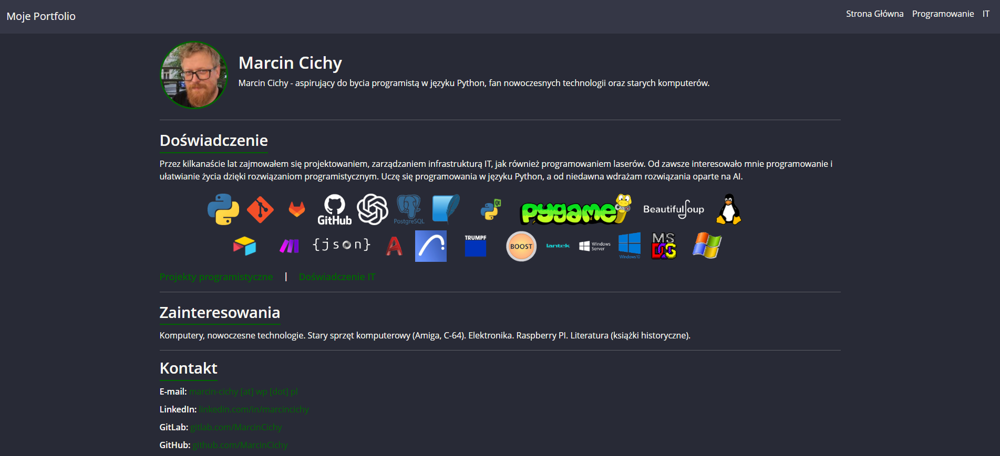

#  My Portfolio 

##  Project Description
This is my **automatically generated portfolio**, which fetches information about my repositories from **GitLab** and elegantly presents them on a website. The page is dynamically created based on the repository contents and additional **Markdown** files.

**Screenshot:**



**Technologies used in this project:**
- Python (Jinja2, Requests, Markdown)
- HTML, CSS (Bootstrap + Dracula theme)
- GitLab CI/CD & GitHub Actions (for automatic building and deployment)

---

## Website Preview
[**View my portfolio on GitLab Pages**](https://marcincichy.gitlab.io/create_myportfolio_page/)  
[**View my portfolio on GitHub Pages**](https://marcincichy.github.io/Create_MyPortfolio_Page/)


---

## Project Structure

```
create_myportfolio_page/
│-- content/           # Markdown files with page content (e.g., construction.md, it.md)
│-- static/            # Static assets: CSS, images, logos
│-- templates/         # HTML templates (Jinja2)
│-- generate_portfolio.py   # Main script generating the website
│-- logos.json         # JSON file containing the list of logos
│-- .gitlab-ci.yml     # CI/CD configuration for GitLab Pages
│-- .github/workflows/deploy.yml # GitHub Actions configuration
│-- README.md          # Project documentation

```
---

## How does the website generation work?

 **1.Fetching data from GitLab API** – The `generate_portfolio.py` script retrieves a list of repositories.

 **2.Reading Markdown content** – The script converts `.md` files into HTML.

 **3.Generating HTML files** – Jinja2 processes templates and generates complete web pages.

 **4.Automatic deployment** – The website is deployed to GitLab Pages and GitHub Pages using CI/CD.

---

## Automatic Updates

The website automatically refreshes thanks to **GitLab CI/CD** and **GitHub Actions**:
- **On GitLab**: A new version is generated with every **commit** or through a **scheduled task**.
- **On GitHub**: The website updates on every **push to main**.

---

